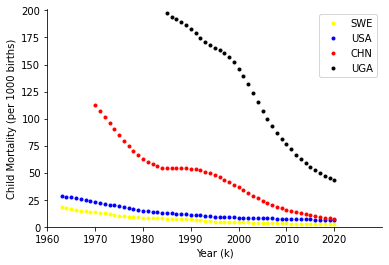
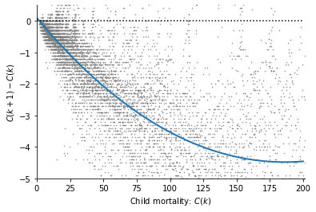
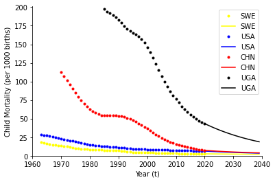
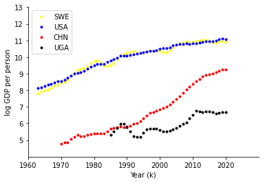
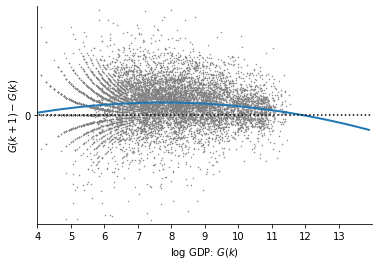
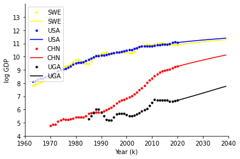
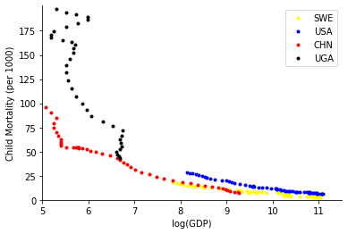
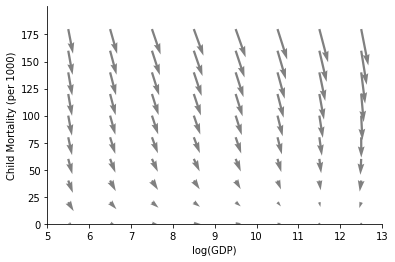
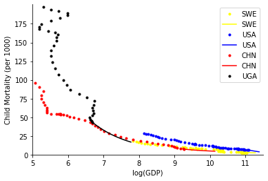

Modelling the World in Data
===========================

In this notebook we will model world development, inspired by the
presentations of `Hans Rosling on 200 years that changed the
world <https://https://www.gapminder.org/videos/200-years-that-changed-the-world/>`__.

We will go through the steps of downloading data from an Application
Programming Interface (API), plotting it, fitting a linear regression
model (with non-linear terms) and then using a model to make future
predictions.

1 Downloading the data
----------------------

First we install the World Bank API in order to download the data.

.. code:: ipython3

    #Install package if not available.
    !pip install world_bank_data
    
    #Import libraries
    #Plotting 
    import matplotlib as mpl
    import matplotlib.pyplot as plt
    #Dataframes (panda) and math opperations (numpy)
    import pandas as pd
    import numpy as np
    #World bank data interface
    import world_bank_data as wb
    #Import machine learning tools (for linear regression)
    import sklearn.linear_model as skl_lm
    import itertools
    import math
    
    # Default plotting options.
    mpl.rcParams['axes.spines.right'] = False
    mpl.rcParams['axes.spines.top'] = False

.. parsed-literal::

    Requirement already satisfied: world_bank_data in /usr/local/lib/python3.7/dist-packages (0.1.3)
    Requirement already satisfied: requests in /usr/local/lib/python3.7/dist-packages (from world_bank_data) (2.23.0)
    Requirement already satisfied: cachetools in /usr/local/lib/python3.7/dist-packages (from world_bank_data) (4.2.4)
    Requirement already satisfied: pandas in /usr/local/lib/python3.7/dist-packages (from world_bank_data) (1.3.5)
    Requirement already satisfied: pytz>=2017.3 in /usr/local/lib/python3.7/dist-packages (from pandas->world_bank_data) (2022.1)
    Requirement already satisfied: numpy>=1.17.3 in /usr/local/lib/python3.7/dist-packages (from pandas->world_bank_data) (1.21.6)
    Requirement already satisfied: python-dateutil>=2.7.3 in /usr/local/lib/python3.7/dist-packages (from pandas->world_bank_data) (2.8.2)
    Requirement already satisfied: six>=1.5 in /usr/local/lib/python3.7/dist-packages (from python-dateutil>=2.7.3->pandas->world_bank_data) (1.15.0)
    Requirement already satisfied: urllib3!=1.25.0,!=1.25.1,<1.26,>=1.21.1 in /usr/local/lib/python3.7/dist-packages (from requests->world_bank_data) (1.24.3)
    Requirement already satisfied: chardet<4,>=3.0.2 in /usr/local/lib/python3.7/dist-packages (from requests->world_bank_data) (3.0.4)
    Requirement already satisfied: certifi>=2017.4.17 in /usr/local/lib/python3.7/dist-packages (from requests->world_bank_data) (2021.10.8)
    Requirement already satisfied: idna<3,>=2.5 in /usr/local/lib/python3.7/dist-packages (from requests->world_bank_data) (2.10)

Now we download the data set, indexed with the country code.

The data is downloaded from here https://databank.worldbank.org/home

.. code:: ipython3

    gdp_percapita = wb.get_series('NY.GNP.PCAP.CD', id_or_value='id', simplify_index=True)
    gdp_percapita
    childmortality = wb.get_series('SH.DYN.MORT', id_or_value='id', simplify_index=True)
    childmortality

.. parsed-literal::

    Country  Year
    AFE      1960     NaN
             1961     NaN
             1962     NaN
             1963     NaN
             1964     NaN
                     ... 
    ZWE      2017    57.0
             2018    54.8
             2019    54.2
             2020    53.9
             2021     NaN
    Name: SH.DYN.MORT, Length: 16492, dtype: float64

Now we reorganise the data so it is in a dataframe (like an Excel
spreadsheet) with columns Year, Country, Child Mortality (per 10,000
births) (:math:`C(k)`), log Gross Domestic Product per person
(:math:`G(k)`) and change in these two variables — :math:`C(k+1)-C(k)`
and :math:`G(k+1)-G(k)` — over time :math:`k`.

(This can take one minute or so to run)

.. code:: ipython3

    cm=childmortality.to_frame()
    gdp=gdp_percapita.to_frame()
    
    df = pd.DataFrame(columns=('Year', 'Country','Child Mortality','GDP','Diff CM','Diff GDP'))
    countries = cm.index
    this_country=''
    this_cm=0
    this_gdp=0
    j=0
    
    for i,c in enumerate(countries):
        
    
        prev_cm=this_cm
        prev_gdp=this_gdp
        prev_country=this_country
            
        #Update for this year.
        this_year=c[1]
        this_cm=cm.iloc[i]['SH.DYN.MORT']
        this_gdp=np.log(gdp.iloc[i]['NY.GNP.PCAP.CD'])
        this_country=c[0]
        
        if (prev_country==this_country):
            #Update differences and put in matrix
            diff_cm=this_cm-prev_cm
            diff_gdp=this_gdp-prev_gdp
            if not(np.isnan(diff_cm) or np.isnan(diff_gdp)):
                df.loc[j] = [this_year,this_country,this_cm,this_gdp,diff_cm,diff_gdp]
                j=j+1
    
    df.head()

.. raw:: html

    
      

        

          

    
    <table border="1" class="dataframe">
      <thead>
        <tr style="text-align: right;">
          <th></th>
          <th>Year</th>
          <th>Country</th>
          <th>Child Mortality</th>
          <th>GDP</th>
          <th>Diff CM</th>
          <th>Diff GDP</th>
        </tr>
      </thead>
      <tbody>
        <tr>
          <th>0</th>
          <td>1991</td>
          <td>AFE</td>
          <td>164.128976</td>
          <td>6.519685</td>
          <td>-1.672551</td>
          <td>0.007455</td>
        </tr>
        <tr>
          <th>1</th>
          <td>1992</td>
          <td>AFE</td>
          <td>162.511815</td>
          <td>6.499524</td>
          <td>-1.617161</td>
          <td>-0.020161</td>
        </tr>
        <tr>
          <th>2</th>
          <td>1993</td>
          <td>AFE</td>
          <td>161.204106</td>
          <td>6.519203</td>
          <td>-1.307709</td>
          <td>0.019680</td>
        </tr>
        <tr>
          <th>3</th>
          <td>1994</td>
          <td>AFE</td>
          <td>161.556769</td>
          <td>6.530270</td>
          <td>0.352663</td>
          <td>0.011067</td>
        </tr>
        <tr>
          <th>4</th>
          <td>1995</td>
          <td>AFE</td>
          <td>156.602259</td>
          <td>6.597989</td>
          <td>-4.954509</td>
          <td>0.067719</td>
        </tr>
      </tbody>
    </table>
    

          <button class="colab-df-convert" onclick="convertToInteractive('df-7231ea3f-5d1a-4d0e-9e6b-04891325fc78')"
                  title="Convert this dataframe to an interactive table."
                  style="display:none;">
    
      <svg xmlns="http://www.w3.org/2000/svg" height="24px"viewBox="0 0 24 24"
           width="24px">
        <path d="M0 0h24v24H0V0z" fill="none"/>
        <path d="M18.56 5.44l.94 2.06.94-2.06 2.06-.94-2.06-.94-.94-2.06-.94 2.06-2.06.94zm-11 1L8.5 8.5l.94-2.06 2.06-.94-2.06-.94L8.5 2.5l-.94 2.06-2.06.94zm10 10l.94 2.06.94-2.06 2.06-.94-2.06-.94-.94-2.06-.94 2.06-2.06.94z"/><path d="M17.41 7.96l-1.37-1.37c-.4-.4-.92-.59-1.43-.59-.52 0-1.04.2-1.43.59L10.3 9.45l-7.72 7.72c-.78.78-.78 2.05 0 2.83L4 21.41c.39.39.9.59 1.41.59.51 0 1.02-.2 1.41-.59l7.78-7.78 2.81-2.81c.8-.78.8-2.07 0-2.86zM5.41 20L4 18.59l7.72-7.72 1.47 1.35L5.41 20z"/>
      </svg>
          </button>
    
      
    
          
        

      

2 Single variable model
-----------------------

2.1 Plotting the data
~~~~~~~~~~~~~~~~~~~~~

We now plot how child mortality has changed in four countries (Sweden,
USA, Uganda and China).

In order look at other countries you can find their codes by looking
here https://data.worldbank.org/country and clicking on the country and
then clicking on (i) to see country code.

.. code:: ipython3

    countries=['SWE','USA','CHN','UGA']
    country_colour_dict= {
      "USA": "blue",
      "CHN": "red",
      "SWE": "yellow",
      "UGA": "black",
      "AFG": "green"
    }
    
    fig,ax=plt.subplots(num=1)
    for country in countries:
        df_country=df.loc[df['Country'] == country]
    
        years=np.array(df_country['Year']).astype('int32')
        ax.plot(years,df_country['Child Mortality'],linestyle='none', color =country_colour_dict[country], markersize=3, marker='o',label=country)
    ax.legend()
    ax.set_xticks(np.arange(1960,2030,step=10))
    ax.set_yticks(np.arange(0,225,step=25))
    ax.set_ylabel('Child Mortality (per 1000 births)')
    ax.set_xlabel('Year (k)')
    ax.spines['top'].set_visible(False)
    ax.spines['right'].set_visible(False)
    ax.set_xlim(1960,2030)
    ax.set_ylim(0,201) 
    
    plt.show()

2.2 Fitting a model to child mortality
~~~~~~~~~~~~~~~~~~~~~~~~~~~~~~~~~~~~~~

Now we fit a linear regression model

.. math::

   y(k) = C(k+1) - C(k) = a + b_0 C(k) + b_1 C(k)^2 + b_2 C(k)^3 + \epsilon, \qquad \epsilon \sim \mathcal{N}(0, \sigma^2)

to describe the change in child mortality from one year to the next.

To do this we use scikitlearn library in Python.

.. code:: ipython3

    #Create the variables
    df['C2'] = df['Child Mortality']**2
    df['C3'] = df['Child Mortality']**3
    X_train = df[['Child Mortality','C2','C3']]
    y_train = df['Diff CM']
    model = skl_lm.LinearRegression(fit_intercept=True)
    model.fit(X_train, y_train)
    # Print the coefficients
    print('The coefficients are:', model.coef_)
    print(f'The offset is: {model.intercept_:.3f}')
    b = model.coef_
    a=model.intercept_

.. parsed-literal::

    The coefficients are: [-5.06386729e-02  1.48003409e-04 -4.32047300e-08]
    The offset is: 0.093

We can now plot the fitted model on the same plot as the data.

.. code:: ipython3

    #Implement the model
    C = np.arange(0,200,0.1)
    dC = a + b[0] * C + b[1]*C**2 + b[2]*C**3
    
    #Make the plot
    fig,ax=plt.subplots(num=1)
    ax.plot(df['Child Mortality'],df['Diff CM'],linestyle='none', markersize=1,color='grey',marker='.')
    ax.plot(C,dC,linewidth=2)
    ax.plot([0 ,200],[0, 0],linestyle=':',color='black')
    ax.set_yticks(np.arange(-5,0.5,step=1))
    ax.set_xticks(np.arange(0,225,step=25))
    ax.set_ylabel('$C(k+1)-C(k)$')
    ax.set_xlabel('Child mortality: $C(k)$')
    ax.spines['top'].set_visible(False)
    ax.spines['right'].set_visible(False)
    ax.set_xlim(0,201) 
    ax.set_ylim(-5,0.5) 
    plt.show()
    
    #Predict future evoltion of child mortality
    fig,ax=plt.subplots(num=1)
    for country in countries:
        df_country=df.loc[df['Country'] == country]
    
        years=np.array(df_country['Year']).astype('int32')
        ax.plot(years,df_country['Child Mortality'],linestyle='none', color =country_colour_dict[country], markersize=3, marker='o',label=country)
      
        numyears=20
        future_CM=np.zeros(numyears)
        future_CM[0]=df_country['Child Mortality'][-1:]
        
        
        for t in range(numyears-1):
            future_CM[t+1]=future_CM[t]+ a + b[0] * future_CM[t] + b[1]*future_CM[t]**2 + b[2]*future_CM[t]**3
        
        ax.plot(int(df_country['Year'][-1:])+np.arange(numyears),future_CM, color =country_colour_dict[country],linestyle='-',label=country)
    ax.legend()
    ax.set_xticks(np.arange(1960,2045,step=10))
    ax.set_yticks(np.arange(0,225,step=25))
    ax.set_ylabel('Child Mortality (per 1000 births)')
    ax.set_xlabel('Year (t)')
    ax.spines['top'].set_visible(False)
    ax.spines['right'].set_visible(False)
    ax.set_xlim(1960,2040)
    ax.set_ylim(0,201)   
    plt.show()

2.3 Fitting a model to log GDP
~~~~~~~~~~~~~~~~~~~~~~~~~~~~~~

**Task:** Now it is your turn! Fit a linear regression model

.. math::

   y(k) = G(k+1) - G(k) = a + b_0 G(k) + b_1 G(k)^2 + \epsilon, \qquad \epsilon \sim \mathcal{N}(0, \sigma^2)

to describe the change in GDP from one year to the next.

The code below is incomplete. Complete it by filling in the ???? to
first make the plot.

.. code:: ipython3

    fig,ax=plt.subplots(num=1)
    for country in countries:
        df_country=df.loc[df['Country'] == country]
    
        years=np.array(df_country['Year']).astype('int32')
        ax.plot(years,df_country['GDP'],linestyle='none', color =country_colour_dict[country], markersize=3, marker='o',label=country)
    ax.legend()
    ax.set_xticks(np.arange(1960,2030,step=10))
    ax.set_yticks(np.arange(5,14,step=1))
    ax.set_ylabel('log GDP per person')
    ax.set_xlabel('Year (k)')
    ax.spines['top'].set_visible(False)
    ax.spines['right'].set_visible(False)
    ax.set_xlim(1960,2030)
    ax.set_ylim(4,13) 
    
    plt.show()

And to fit the model asked for by filling in the missing info…

.. code:: ipython3

    #Create the variables
    df['G2'] = df['GDP']**2
    #Set up the model
    X_train = df[['GDP','G2']]
    y_train = df['Diff GDP']
    #Fit the model
    model = skl_lm.LinearRegression(fit_intercept=True)
    model.fit(X_train, y_train)
    # Print the coefficients
    print('The coefficients are:', model.coef_)
    print(f'The offset is: {model.intercept_:.3f}')
    b = model.coef_
    a=model.intercept_

.. parsed-literal::

    The coefficients are: [ 0.05143308 -0.003319  ]
    The offset is: -0.142

And here you should fill in everything needed to make the plots.

.. code:: ipython3

    G = np.arange(0,14,0.1)
    dG = a + b[0] * G + b[1]*G**2 
    
    #Make the plot
    fig,ax=plt.subplots(num=1)
    ax.plot(df['GDP'],df['Diff GDP'],linestyle='none', markersize=1,color='grey',marker='.')
    ax.plot(G,dG,linewidth=2)
    ax.plot([0 ,200],[0, 0],linestyle=':',color='black')
    ax.set_yticks(np.arange(-5,0.5,step=1))
    ax.set_xticks(np.arange(4,14,step=1))
    ax.set_ylabel('$G(k+1)-G(k)$')
    ax.set_xlabel('log GDP: $G(k)$')
    ax.spines['top'].set_visible(False)
    ax.spines['right'].set_visible(False)
    ax.set_xlim(4,14) 
    ax.set_ylim(-0.5,0.5) 
    plt.show()
    
    #Predict future evoltion of child mortality
    fig,ax=plt.subplots(num=1)
    for country in countries:
        df_country=df.loc[df['Country'] == country]
    
        years=np.array(df_country['Year']).astype('int32')
        ax.plot(years,df_country['GDP'],linestyle='none', color =country_colour_dict[country], markersize=3, marker='o',label=country)
      
        numyears=20
        future_GDP=np.zeros(numyears)
        future_GDP[0]=df_country['GDP'][-1:]
        
        
        for t in range(numyears-1):
            future_GDP[t+1]=future_GDP[t]+ a + b[0] * future_GDP[t] + b[1]*future_GDP[t]**2 
    
        ax.plot(int(df_country['Year'][-1:])+np.arange(numyears),future_GDP, color =country_colour_dict[country],linestyle='-',label=country)
    ax.legend()
    ax.set_xticks(np.arange(1960,2045,step=10))
    ax.set_yticks(np.arange(4,14,step=1))
    ax.set_ylabel('log GDP')
    ax.set_xlabel('Year (k)')
    ax.spines['top'].set_visible(False)
    ax.spines['right'].set_visible(False)
    ax.set_xlim(1960,2040)
    ax.set_ylim(4,14)   
    plt.show()

3 Two variable model
--------------------

3.1 Plotting the data
~~~~~~~~~~~~~~~~~~~~~

We now make a Gapminder style plot of the data.

.. code:: ipython3

    # Plot phase portrait
    fig,ax=plt.subplots(num=1)
    for country in countries:
        df_country=df.loc[df['Country'] == country]
        ax.plot(df_country['GDP'], df_country['Child Mortality'],linestyle='none', markersize=3, color =country_colour_dict[country],  marker='o',label=country)
        
    ax.legend()
    ax.set_xticks(np.arange(5,12,step=1))
    ax.set_yticks(np.arange(0,200,step=25))
    ax.set_ylabel('Child Mortality (per 1000)')
    ax.set_xlabel('log(GDP)')
    ax.spines['top'].set_visible(False)
    ax.spines['right'].set_visible(False)
    ax.set_ylim(0,201) 
    ax.set_xlim(5,11.5) 

.. parsed-literal::

    (5.0, 11.5)

3.2 Fitting a model to data
~~~~~~~~~~~~~~~~~~~~~~~~~~~

Now we fit a linear regression model where child mortality and GDP can
influence each other. We assume that

.. math::

   y_C(k) = C(k+1) - C(k) = a_C + b_{C0} C(k) + b_{C1} C(k)^2 + b_{C2} C(k)^3 + b_{C3} G(k) + b_{C4} G(k)^2 + b_{C5} C(k) G(k) + \epsilon_C(k), \qquad \epsilon_C(k) \sim \mathcal{N}(0, \sigma_C^2)

and

.. math::

   y_G(k) = G(k+1) - G(k) = a_G + b_{G0} C(k) + b_{G1} C(k)^2 + b_{G2} C(k)^3 + b_{G3} G(k) + b_{G4} G(k)^2 + b_{G5} C(k) G(k) + \epsilon_G(k), \qquad \epsilon_G(k) \sim \mathcal{N}(0, \sigma_G^2)

describes the interaction and fit the model below. We fit the model then
plot the vector field it creates.

.. code:: ipython3

    # Fit model
    df['G2'] = df['GDP']**2
    df['CG'] = df['GDP']*df['Child Mortality']
    X_train = df[['Child Mortality','C2','C3','GDP','G2','CG']]
    y_train = df['Diff CM']
    model = skl_lm.LinearRegression(fit_intercept=True)
    model.fit(X_train, y_train)
    # Print the coefficients
    print('The coefficients are:', model.coef_)
    print('The offset is: {model.intercept_:.3f}')
    G,C = np.meshgrid(np.arange(5.5, 13, step=1),np.arange(0, 200, step=20))
    b = model.coef_
    a =model.intercept_
    dC = a + b[0] * C + b[1]*C**2 + b[2]*C**3 + b[3]*G + b[4]*G**2 + b[5]*C*G
    
    
    X_train = df[['Child Mortality','C2','C3','GDP','G2','CG']]
    y_train = df['Diff GDP']
    model = skl_lm.LinearRegression(fit_intercept=True)
    model.fit(X_train, y_train)
    # Print the coefficients
    print('The coefficients are:', model.coef_)
    print('The offset is: {model.intercept_:.3f}')
    bG = model.coef_
    aG =model.intercept_
    dG = aG + bG[0] * C + bG[1]*C**2 + bG[2]*C**3 + bG[3]*G + bG[4]*G**2 + bG[5]*C*G
    
    
    fig,ax=plt.subplots(num=1)
    ax.quiver(G,C,dG*20,dC,color='grey')
    ax.set_xticks(np.arange(5,13.5,step=1))
    ax.set_yticks(np.arange(0,200,step=25))
    ax.set_ylabel('Child Mortality (per 1000)')
    ax.set_xlabel('log(GDP)')
    ax.spines['top'].set_visible(False)
    ax.spines['right'].set_visible(False)
    ax.set_ylim(0,201) 
    ax.set_xlim(5,13) 
    plt.show()

.. parsed-literal::

    The coefficients are: [-2.16303485e-02  7.56446660e-05  5.70791553e-08  9.57900886e-01
     -4.60721404e-02 -2.41261456e-03]
    The offset is: {model.intercept_:.3f}
    The coefficients are: [-1.00762718e-03  3.75608966e-06 -5.95016644e-09  4.19670357e-02
     -2.95079219e-03  7.89412250e-05]
    The offset is: {model.intercept_:.3f}

3.3 Predicting future changes.
~~~~~~~~~~~~~~~~~~~~~~~~~~~~~~

The following code simulates child mortality and GDP on the basis of the
model. It is however incorrect for GDP. Correct the model so it is
consistent with the fitting in the previous section and run it to show
how we would expect the two variables to change in the future.

.. code:: ipython3

    #Simulate on phase portrait.
    fig,ax=plt.subplots(num=1)
    for country in countries:
        df_country=df.loc[df['Country'] == country]
        ax.plot(df_country['GDP'], df_country['Child Mortality'],linestyle='none', markersize=3, color =country_colour_dict[country],  marker='o',label=country)
           
        numyears=20
        future_CM=np.zeros(numyears)
        future_CM[0]=df_country['Child Mortality'][-1:]
        future_GDP=np.zeros(numyears)
        future_GDP[0]=df_country['GDP'][-1:]
        
        ax.legend()
        
        for t in range(numyears-1):
            future_CM[t+1]=future_CM[t]+ a + b[0] * future_CM[t] + b[1]*future_CM[t]**2 + b[2]*future_CM[t]**3  + b[3]*future_GDP[t] + b[4]*future_GDP[t]**2 + b[5]*future_CM[t]*future_GDP[t]
            future_GDP[t+1]=future_GDP[t]+ aG + bG[0] * future_CM[t] + bG[1]*future_CM[t]**2 + bG[2]*future_CM[t]**3 + bG[3]*future_GDP[t] + bG[4]*future_GDP[t]**2 + bG[5]*future_CM[t]*future_GDP[t]
        
        ax.plot(future_GDP,future_CM, color =country_colour_dict[country],linestyle='-',label=country)
    
    ax.set_xticks(np.arange(5,12,step=1))
    ax.set_yticks(np.arange(0,200,step=25))
    ax.set_ylabel('Child Mortality (per 1000)')
    ax.set_xlabel('log(GDP)')
    ax.spines['top'].set_visible(False)
    ax.spines['right'].set_visible(False)
    ax.set_ylim(0,201) 
    ax.set_xlim(5,11.5)   

.. parsed-literal::

    (5.0, 11.5)

